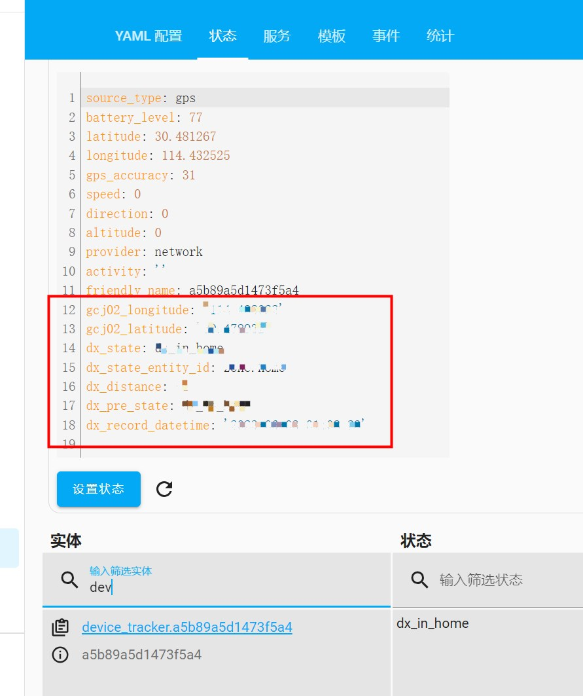

<!--
 * @Author        : dx
 * @Github        : https://github.com/d380025303
 * @Description   : 
 * @Date          : 2023-06-04
 * @LastEditors   : dx
 * @LastEditTime  : 2023-06-04 14:56:00
 -->

# Ha Gaode Server

[](https://github.com/hacs/integration)

需要配合[ha_gaode](https://github.com/d380025303/ha_gaode) 一起食用

## 手动安装
* 1. 下载 `custom_components\ha_gaode_server` 下的所有文件
* 2. 复制到 `\config\custom_components` (包括ha_gaode_server文件夹)
* 3. 重启Home Assistant
* 4. 此时应该可以在 配置 > 设备与服务 > 添加集成内搜索到了
* 5. 不过这里添加不了, 需要修改 configuration.yaml, 增加以下配置
    ```yaml
    ha_gaode_server:
      # 高德Server Key: 此key需要是"Web服务"类型, 需要与Web端(JS API)区分开 
      gaode_server_key: 你的高德serverkey  
      # 是否同步修改GPSLogger实体的状态, 虽然本项目状态与GPSLogger一致, 但某些其它包可能会自定义状态(比如本项目2.0版本,已调整), 可将此设置为 False
      change_gpslogger_state: True 
    ```

~~## HACS 安装~~

~~1. HACS > 集成 浏览并下载存储库 > 搜索 ```dxgaodeserver```，点击下载~~

~~2. 参见`手动安装`第三步及以后~~

~~如果搜索不到, 可手动添加自定义存储库~~
~~- 存储库: https://github.com/d380025303/ha_gaode_server~~
~~- 类别: 集成~~


## 详细说明
GPSLogger 通过 [ha_gaode_server](https://github.com/d380025303/ha_gaode_server) 获得了一些增强属性


- gcj02_longitude: 高德的经度
- gcj02_latitude: 高德的纬度
- dx_state: 设备当前状态
```text
home: "我的家"实体范围内
zone.XXX: 在zone.XXX的实体范围内
not_home: 不在任何范围内
```
- dx_pre_state: 设备前一个状态, 状态值同 ```dx_state```
- dx_distance: 当进入范围内, 距离中心的距离, 如果不在范围内, 值为 -1
- `dx_record_datetime`: GPSLogger上报时间
